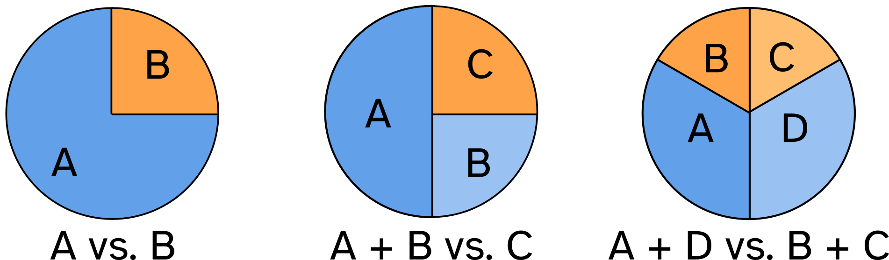

# Project Overview

Currently I am working on 2 projects.

## 1. 100 Years of Pies vs. Bars

This research project explores a century-long debate in data visualization: Are pie charts or bar charts better for understanding data?  We're evaluating how well people interpret different chart formats under various settings in experiments and publications spanning the 1920s to the present.  We want to determine which chart is best for calculating percentages, comparing segments, and rating objects, and explain why these visual choices matter in education, media, and science.

## 2. Auditing the Computing Book

The second project involves going through statistical computing textbook used in Stat 850 class and identifying issues like broken links, typos, unclear instructions, or outdated content. In parallel, I'm participating in a self-paced online training program called WAI (Web Accessibility Initiative) to understand how to make digital materials more accessible for users with disabilities. This helps ensure that all learners, regardless of ability, can benefit from well-designed online education tools.

---

# Daily Journal

### Today's To-Do List (June 18, 2025)

-   [x] Finalize README file
-   [ ] Audit Computing books of chapter 2,3
-   [ ] Finish module 4,5 of WAI training

## What I Did Last Week:

-   Finished drafting the report.
-   Presented "100 years of pies vs. bars" project
-   Began auditing the Markdown chapter of the Computing Book.
-   Started WAI course and completed the first 3 units.

## Challenges:

-   Need to finalize the writing part of the project. Not sure about including pictures in the report

---

## Picture of the Day

---

## Plans for Next Week:

-   Finalize and submit draft of full report

-   Finish the training

-   Push updates and open GitHub issues (if required) for at least two additional chapters of the Computing Book.

-   Complete all remaining WAI training units and draft a summary of what I learned.

